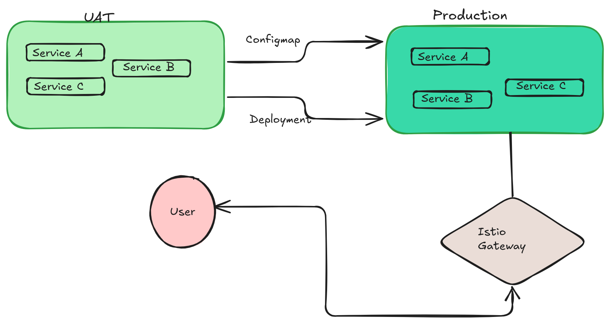

# Approach Paper - OpenShift Microservices Migration (UAT to Production)

## Table of Contents

- [Objective](#objective)
- [Proposed Solutions](#proposed-solutions)
  - [Approach 1](#approach-1)
  - [Approach 2](#approach-2)
- [Chosen Approach](#chosen-approach)
- [Approach 1: Details](#approach-1-details)
  - [Architecture Diagram](#31-architecture-diagram)
  - [Description](#32-description)
  - [Pre-requisites](#33-pre-requisites)
    - [Hardware Requirements](#331-hardware-requirements)
    - [Software Requirements](#332-software-requirements)
    - [Networking Requirements](#333-networking-requirements)
- [Approach 2: Details](#approach-2-details)
  - [Architecture Diagram](#41-architecture-diagram)
  - [Description](#42-description)
  - [Pre-requisites](#43-pre-requisites)
    - [Hardware Requirements](#431-hardware-requirements)
    - [Software Requirements](#432-software-requirements)
    - [Networking Requirements](#433-networking-requirements)
- [Conclusion](#conclusion)

## 1. Objective

The objective of this approach paper is to outline the steps for migrating microservices from the User Acceptance Testing (UAT) environment to the Production environment in OpenShift. This process ensures a smooth transition while maintaining service integrity, security, and efficiency.

## 2. Proposed Solutions

### Approach 1

- Migrate microservices individually by exporting their ConfigMap and Deployment definitions from the UAT environment and applying them to the Production environment.
- Modify configurations as needed to align with production standards.
- Deploy the services, expose them externally, and validate using `cURL`.
- Configure Istio for secure traffic management and monitoring.

### Approach 2

- Implement a CI/CD pipeline that automates the migration of microservices from UAT to Production.
- Use GitOps tools such as ArgoCD or OpenShift Pipelines to manage deployments.
- Automate testing and validation before final deployment.
- Integrate Istio for seamless traffic routing and failover handling.

## Chosen Approach

**Approach 1** is chosen for its step-by-step manual control over microservices migration, ensuring flexibility and adaptability to unexpected changes.

## 3. Approach 1: Details

### 3.1 Architecture Diagram

### 3.2 Description

This approach follows a controlled migration of microservices from UAT to Production, ensuring all configurations, deployments, and services are properly applied and validated before making them available to users.

#### Pros:
- Provides precise control over each microservice migration.
- Easy debugging and rollback in case of issues.
- Ensures proper validation at each step.

#### Cons:
- Requires manual intervention for each microservice.
- Potential delays due to human oversight.

### 3.3 Pre-requisites

#### 3.3.1 Hardware Requirements

- OpenShift cluster with UAT and Production environments.
- Minimum **2 CPU cores** and **8GB RAM** per environment.

#### 3.3.2 Software Requirements

- OpenShift 
- Istio Service Mesh

#### 3.3.3 Networking Requirements

- Proper DNS setup for external service access.
- Secure API endpoints for microservices.

## 4. Approach 2: Details

### 4.1 Architecture Diagram

### 4.2 Description

This approach automates microservice migration through a CI/CD pipeline, reducing manual work and ensuring consistent deployments.

#### Pros:
- Eliminates manual errors.
- Faster deployments and rollbacks.

#### Cons:
- Requires initial setup of CI/CD pipelines.
- Less flexibility in handling unique microservice configurations.

### 4.3 Pre-requisites

#### 4.3.1 Hardware Requirements

- OpenShift cluster with UAT and Production environments.
- CI/CD infrastructure with at least **4 CPU cores** and **16GB RAM**.

#### 4.3.2 Software Requirements

- OpenShift
- ArgoCD / OpenShift Pipelines (Tekton)
- Git and GitOps workflow
- Istio Service Mesh

#### 4.3.3 Networking Requirements

- Secure Git repository access.
- Network latency < **10ms** for efficient synchronization.

## Conclusion

**Approach 1** has been selected as the best-fit solution, ensuring controlled and flexible microservice migration. The deployment process involves retrieving configurations, modifying them for production, applying them, exposing services, and verifying through Istio. This guarantees a smooth transition while maintaining operational stability and security.
